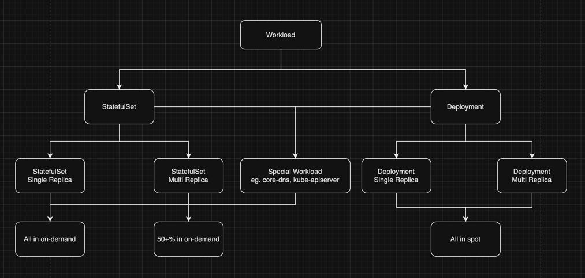
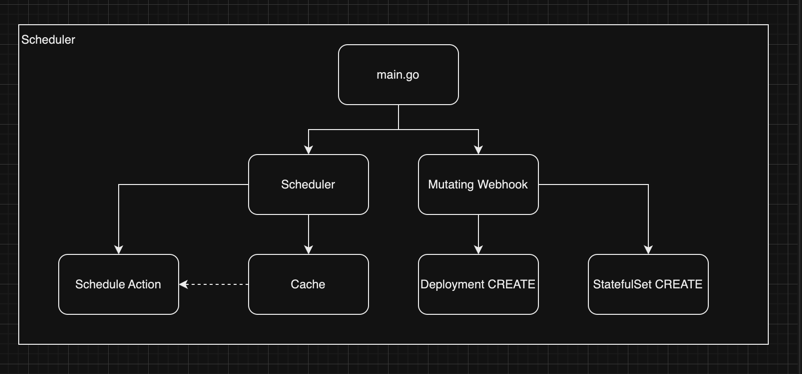

# Distributed Scheduling

## Design Conditions

<!--
- 节点由按需节点(On-demand)和临时节点(Spot)组成
- Workload 以 Deployment 和 StatefulSet 组成
- Workload 包含单副本和多副本的负载
- 所有的临时节点可能会同时被终止
- 临时节点会在2分钟通知后终止
- 不设置 PDB
- 不考虑存储迁移, CSI 会负责
-->

- Nodes consist of On-demand and Spot instances.
- Workloads are composed of Deployments and StatefulSets.
- Workloads include both single-replica and multi-replica loads.
- All Spot instances may be terminated at the same time.
- Spot instances will terminate after a 2-minute notification.
- Pod Disruption Budgets (PDBs) are not set.
- Storage migration is not considered; CSI will handle it.

## Design Goals

<!--
- 不中断服务
- 最大化使用临时节点代替按需节点, 降低成本
- 不改变已使用的调度器, 需要通过别的方式影响调度结果
-->

- No service interruption
- Maximize the use of spot nodes instead of on-demand nodes to reduce costs
- Do not change the currently used scheduler; influence the scheduling outcome through other means

## Difficulty Analysis

<!--
1. 需要有一种方式在不改变调度器的情况下影响调度结果
2. 能够让单一工作负载可以按需 + 临时节点**混合部署**
3. 需要能够尽量达到最大化使用临时节点, 每个负载使用按需节点的界限
-->

1. There needs to be a way to influence scheduling outcomes without changing the scheduler.
2. Single workloads should be able to be deployed in a **mixed mode** using both on-demand and spot nodes.
3. It is necessary to maximize the use of spot nodes, with clear boundaries for each workload's use of on-demand nodes.

### Difficulty 1

<!--
需要有一种方式在不改变调度器的情况下影响 Pod 的调度结果:
-->

There needs to be a way to influence scheduling outcomes without changing the scheduler:

1. Scheduling Framework: Requires modifying the Kube-Scheduler, not considered.
2. Scheduler Extenders: Deprecated, not considered.
3. Node Affinity
4. Taints and Tolerations
5. TopologySpreadConstraints

### Difficulty 2

<!--
能够让单一工作负载可以按需+临时节点**混合部署**.
-->

Single workloads should be able to be deployed in a **hybrid** manner using both on-demand and spot nodes.

#### 1. Split Workload(Deployment)

```yaml
apiVersion: apps/v1
kind: Deployment
metadata:
  name: critical-app-on-demand
spec:
  replicas: 3
  selector:
    matchLabels:
      app: critical-app
  template:
    metadata:
      labels:
        app: critical-app
    spec:
      affinity:
        nodeAffinity:
          requiredDuringSchedulingIgnoredDuringExecution:
            nodeSelectorTerms:
            - matchExpressions:
              - key: node.kubernetes.io/capacity
                operator: In
                values:
                - on-demand
---
apiVersion: apps/v1
kind: Deployment
metadata:
  name: critical-app-spot
spec:
  replicas: 7
  selector:
    matchLabels:
      app: critical-app
  template:
    metadata:
      labels:
        app: critical-app
    spec:
      affinity:
        nodeAffinity:
          preferredDuringSchedulingIgnoredDuringExecution:
            - weight: 100
              preference:
                matchExpressions:
                  - key: node.kubernetes.io/capacity
                    operator: In
                    values:
                      - spot
```

<!--
原 Deployment 需要通过 `spec.paused` 来**停止调度**.
-->

The original Deployment needs to use `spec.paused` to **stop scheduling**.

#### 2. By NodeAffinity + topologySpreadConstraints

<!--
示例负载要求:
- 共 10 Replicas
- 最少 2 Replicas 在按需节点
-->

Example workload requirements:
- A total of 10 replicas
- At least 2 replicas on on-demand nodes

##### Ideal Situation

<!--
通过配置 topologySpreadConstraints 来告诉调度器正常情况允许的 Pod 数量的差值为 6,
同时在 NodeAffinity 中, 告诉调度器优先调度到 Spot 节点上,
在理想情况下, Spot 节点的 Replicas 总数为8, On-demand 节点为 6, 他们相差 6.
-->

Configure `topologySpreadConstraints` to inform the scheduler that the normal allowable difference in pod numbers is 6.
In `NodeAffinity`, instruct the scheduler to prioritize scheduling to spot nodes.
Ideally, there would be 8 replicas on spot nodes and 2 on on-demand nodes, with a difference of 6.

##### Abnormal Condition

<!--
在资源不足的情况下, 如 Spot 资源不足,
`whenUnsatisfiable: DoNotSchedule` 会尽可能缩小两种节点之前Replicas数量的差距(maxSkew),
如果 `on-demand Replica` 数量要求 < `spot Replica` 数量要求, 会优先保证 `on-demand` 的 Replica 数量.
-->

In cases of resource scarcity, such as insufficient spot resources, `whenUnsatisfiable: DoNotSchedule`
will minimize the difference in the number of replicas between the two types of nodes (maxSkew).
If the required number of `on-demand replicas` is less than the required number of `spot replicas`,
the system will prioritize ensuring the number of `on-demand` replicas.

```yaml
apiVersion: apps/v1
kind: Deployment
metadata:
  name: demo1
spec:
  replicas: 10
  selector:
    matchLabels:
      app: demo1
  template:
    metadata:
      labels:
        app: demo1
    spec:
      affinity:
        nodeAffinity:
          preferredDuringSchedulingIgnoredDuringExecution:
            - weight: 100
              preference:
                matchExpressions:
                  - key: "node.kubernetes.io/capacity"
                    operator: In
                    values:
                      - "spot"
            - weight: 1
              preference:
                matchExpressions:
                  - key: "node.kubernetes.io/capacity"
                    operator: In
                    values:
                      - "on-demand"
      topologySpreadConstraints:
        - maxSkew: 6
          topologyKey: "node.kubernetes.io/capacity"
          whenUnsatisfiable: DoNotSchedule
          labelSelector:
            matchLabels:
              app: demo1
          minDomains: 2
      containers:
        - name: nginx
          image: nginx:latest
```

#### 3. Update Each Pods' Node Affinity

<!--
在不修改 Deployment 配置的情况下, 我们可以在 Pod CREATE 的时候打上 NodeAffinity,
从而达到我们需要的混合部署的 Replica 数量.

已创建的 Pod 是不允许修改 `spec.affinity` 字段, 我们不能修改 Scheduler 的情况下,
可以考虑通过 Webhook 在创建新Pod的时候修改/添加他的 NodeAffinity,
对于已部署的负载, 我们可以逐个 Pod 进行重建, 重启后设置为我们需要的混合部署配置.
当用户修改目标混合部署配置时, 删除多余的 require-in-on-spot Replica,
或是删除多余的 prefer-in-spot Replica,
然后在新的 Pod 创建的时候继续通过 Mutating Webhook 来修改新的 Pod 的 Affinity.
-->

Without modifying the Deployment configuration, we can apply `NodeAffinity` to the pods at the time of their creation,
thus achieving the required number of replicas for hybrid deployment.

Since modifying the `spec.affinity` field of already created pods is not allowed, and without modifying the scheduler,
you can consider using a Webhook to modify/add the `NodeAffinity` of a pod when it is being created.
For already deployed workloads, you can manually restart each pod,
setting it to the required hybrid deployment configuration upon restart.

When users modify the target hybrid deployment configuration,
remove the excess require-in-on-spot replicas or the excess prefer-in-spot replicas.
Then, continue to modify the affinity of new pods during their creation through a Mutating Webhook.

#### Result

<!--
方案1可以达到要求, 但是实现过于复杂, 且会影响用户看到的资源.

方案2勉强可以达到要求, 但是仍然需要修改 Deployment.

方案3不仅可以达到要求, 也可以在用户**无感知**的条件下实现需要的能力.
-->

Solution 1 can meet the requirements, but it is overly complex and may affect the resources visible to the user.

Solution 2 can barely meet the requirements, but still requires modifying the Deployment.

Solution 3 not only meets the requirements but also achieves the desired capabilities **without the user's awareness**.

##### Solution 1

<!--
优点:
- 在集群资源足够/不足的情况都会尽量按预期的结果进行调度

缺点:
- 维护较难, 比如状态同步, 配置更新
- 对用户不友好, 本来1个 Deployment 现在成了3个
- 工作量较大, 要先停止原负载的调度(Webhook), 再去维护三个 Deployment 之间的关系
- 可能对 `Prometheus` 一类应用不太友好
-->

Advantages:
- It attempts to schedule as expected both in cases where cluster resources are sufficient and insufficient.

Disadvantages:
- Maintenance is challenging, such as synchronizing states and updating configurations.
- It is user-unfriendly; what was originally one Deployment now becomes three.
- The workload is significant; it involves stopping the scheduling of the original workload via a Webhook and then maintaining the relationships among the three Deployments.
- It may not be very friendly to applications like Prometheus.

##### Solution 2

<!--
优点:
- 实现简单, 无需维护多个资源, 只需要对每个Workload进行配置即可
- 在集群资源足够的情况下可以按预期结果进行调度

缺点:
- 在 Spot 节点不足的情况下, 会导致 On-demand 节点有可能达不到要求的 Replica 数量(视maxSkew和其他条件)
- nodeAffinity 和 topologySpreadConstraints 只是尽量去达到要求, 可能会有非预期的结果
- 如果用户设置了 nodeAffinity / topologySpreadConstraints, 可能会对用户有非预期的调度结果
-->

Advantages:
- Simple implementation, no need to maintain multiple resources, just need to configure each workload.
- Under conditions of sufficient cluster resources, scheduling can proceed as expected.

Disadvantages:
- In cases of insufficient spot nodes, there is a possibility that the number of replicas on on-demand nodes may not meet the required amount (depending on maxSkew and other conditions).
- `nodeAffinity` and `topologySpreadConstraints` are only attempts to meet the requirements and may lead to unexpected results.
- If users set their own `nodeAffinity` or `topologySpreadConstraints`, it could lead to unexpected scheduling outcomes for them.

##### Solution 3

<!--
优点:
- 实现不难.
- 能够几乎完美的达到混合部署的 Replica 数量要求

缺点:
- 需要实现 Webhook, 有可能需要更多的组件部署在集群上
-->

Advantages:
- Implementation is not difficult.
- Can nearly perfectly achieve the required number of replicas for hybrid deployment.

Disadvantages:
- Requires the implementation of a Webhook, which might necessitate deploying additional components in the cluster.

### Difficulty 3

<!--
需要能够尽量达到最大化使用临时节点, 每个负载使用按需节点的界限.
-->

It is necessary to maximize the use of spot nodes, with clear boundaries for each workload's use of on-demand nodes.

#### Points to Consider

<!--
- 要考虑单/多副本工作负载
- 要考虑有/无状态的工作负载
- 可能的结果是通过按需/混合部署的方式处理负载
- 用户能够**自己设定**某负载在按需节点的 Replica
-->

- Consideration must be given to single/multiple replica workloads.
- Consideration must be given to stateful/stateless workloads.
- Possible outcomes include handling workloads through on-demand/mixed deployment methods.
- Users should be able to **set themselves** the number of replicas for certain workloads on on-demand nodes.

#### Design Approach

<!--
对于单副本的 Deployment, 它可以视为对高可用的要求不高的负载(如开发/测试环境, 后台任务, 一次性/临时任务)
那么不需要特别关注它单副本的特性, 可以归为多副本工作负载一起考虑.

Deployment 一般是无状态服务, 即使需要持久化数据/Session, 设计上一般也是要放在 MySQL/Redis 负载中,
所以在我的设计中, 默认情况下 Deployment 负载可以将所有 Replica 放在 Spot 节点.

对于单副本的 StatefulSet, 虽然它被视为对可用性的要求不高, 但是保证它的可用性的代价是比较低的,
所以在我的设计中默认会放在 On-demand 节点中.

对于多副本的 StatefulSet, 一般可能为 MySQL/Redis/RabbitMQ 等负载,
如果是多主/集群部署下, 一半节点不可用/Master节点不可用会导致应用不可用,
所以在我的设计中, 多副本的 StatefulSet, 默认要求**大于一半的节点部署在 On-demand**节点上以保证可用性.

同时, 以上所有的配置都是默认情况的配置, 用户可以根据自己的需求去配置一些关键性的负载,
或是降低某些 StatefulSet 的 On-demand 节点的 Replica 数量要求.
-->

For single-replica Deployments, they can be considered as having lower HA requirements,
suitable for use cases like development/testing environments, background tasks, or temporary/one-time tasks.
Therefore, their single-replica nature does not need special attention and can be considered alongside multi-replica workloads.

Deployments are generally stateless services. Even if persistence of data/sessions is required,
the design typically involves storing data in MySQL/Redis. Therefore, in my design, by default,
all replicas of a Deployment can be placed on spot nodes.

For single-replica StatefulSets, although they are considered to have lower availability requirements,
ensuring their availability is relatively inexpensive. Thus, in my design, they are by default placed on on-demand nodes.

For multi-replica StatefulSets, which typically might include workloads like MySQL, Redis, or RabbitMQ,
if they are deployed in a multi-master or cluster configuration, the unavailability of half of the nodes
or the master node can lead to application downtime. Therefore, in my design, for multi-replica StatefulSets,
**more than half of the nodes are required to be on on-demand nodes** to ensure availability.

All the above configurations are defaults, and users can modify these settings based on their specific needs,
either to prioritize certain key workloads or to reduce the on-demand node replica requirements for some StatefulSets.



## Design Distributed Scheduler

### Name

**vmanager**

### Feature Point

- MutatingWebhook
- Scheduler
- Cache(Informers)
- Node Signal

### Implementation Approach



### User Configuration for Individual Workload Scheduling

Configure using labels.

```yaml
# Enable/disable scheduling for the workload, default: false, type: bool
vacant.io/optimize-scheduling=true
vacant.io/optimize-scheduling=false

# Scheduling mode (default is as previously discussed), type: string
# All in on-demand
vacant.io/optimize-scheduling-mode=all-in-on-demand
# All in spot
vacant.io/optimize-scheduling-mode=all-in-spot
# Majority in on-demand
vacant.io/optimize-scheduling-mode=majority-in-on-demand
# Custom (must configure vacant.io/optimize-scheduling-mode-custom-on-demand)
vacant.io/optimize-scheduling-mode=custom

# Custom on-demand count (mode must be custom), type: int
vacant.io/optimize-scheduling-mode-custom-on-demand=3
#vacant.io/optimize-scheduling-mode-custom-on-demand=30%
```

### How to Handle Inconsistencies with Expected Pod Affinity Configuration

<!--
这种情况可能会出现在:

1. 在部署负载后, 部署 `vmanager`, 这时负载已经在运行了
2. 用户修改了调度模式, 或是关闭了对 Workload 的调度
3. Deployment 配置变更

处理思路:

1. 将负载对应的 Pod 逐个 Delete, 在 `kube-cm` 创建 Pod 后通过 Webhook 配置为需要的 Affinity, 然后 Pod 被 kube-scheduler 调度
2. 执行 Delete 的 Pod 应是与预期 Affinity 不符的 Pod, 比如有3个临时+2个按需, 但是我们要求2个临时+3个按需, 那只需要删除一个临时 Pod 即可
3. 执行 Delete 的前提是 Workload 目前是健康状态, 如果他某一些 Pod 因为一些原因没有到 Running, 这时我们不应该去执行 Delete, 按照这个思路就可以做到第一条的逐个 Delete

另一种更快速的处理思路:

我们可以在 Scheduler 中监听 Workload 的变更, 如果发生变更则重建 Pod, 并且 Webhook 在 Patch Pod 的时候打上`corev1.PodDeletionCost`来优先删除 Spot 节点上的负载.

同时, 这种方式可以一次性处理单个负载, 而不是像上文提到的要逐个重建 Pod.
-->

This situation might occur in:

1. After deploying a workload, deploying `vmanager`, by which time the workload is already running.
2. The user modifies the scheduling mode, or disables scheduling for the workload.
3. Changes in Deployment configuration.

Approach to handling:

1. Delete each corresponding pod of the workload one by one. After `kube-cm` creates the pod, configure the required Affinity through a Webhook, and then the pod is scheduled by kube-scheduler.
2. The pods to be deleted should be those that do not match the expected Affinity. For example, if there are 3 spot + 2 on-demand, but we require 2 spot + 3 on-demand, then only one spot pod needs to be deleted.
3. The prerequisite for executing Delete is that the workload is currently in a healthy state. If some pods are not running due to some reason, we should not execute Delete. Following this approach, it is possible to achieve the one-by-one deletion as mentioned in the first point.

An alternative, quicker handling approach:

We can listen for changes in the workload within the Scheduler.
If a change occurs, rebuild the pod, and during the Patch Pod operation,
apply `corev1.PodDeletionCost` to prioritize the deletion of workloads on spot nodes.

Additionally, this method can handle a single workload at once,
unlike the previous method which requires rebuilding pods one by one.

### How does the Webhook part determine whether to label new pods, and what NodeAffinity to assign

<!--
这个问题关系到 Scheduler 和 Webhook 部分数据的共享.

1. 让 Scheduler 和 Webhook 都持有同一份 Cache 模块
2. (在 Deployment 关联的 ReplicaSet)和(StatefulSet)的 Annotation 中标注下一个 Pod 的 NodeAffinity 预期配置(如, On-demand/Spot)
3. 让 Scheduler 和 Webhook 都持有一个新的模块, 负责传递每一次 Delete Pod 相关信息, 如 Scheduler 决定 Delete Deployment1 的1个 Pod, 并且转为 On-demand, 那么对这个模块的 Channel 传入一个"On-demand"
4. Scheduler 和 Webhook 各自持有一份 Cache, 在集群不是非常大的情况下可以忽略资源浪费
-->

This issue relates to the sharing of some data between the Scheduler and Webhook.

1. Allow both the Scheduler and Webhook to hold a shared Cache module.
2. Mark the expected NodeAffinity configuration for the next pod in the Annotations of the associated ReplicaSet (in Deployment) and StatefulSet (e.g., On-demand/Spot).
3. Let both the Scheduler and Webhook hold a new module responsible for transmitting information related to each Delete Pod action, such as when the Scheduler decides to delete one pod from Deployment1 and switch it to On-demand, then input "On-demand" into this module's Channel.
4. Both the Scheduler and Webhook maintain their own Cache. This resource wastage can be ignored if the cluster is not very large.
