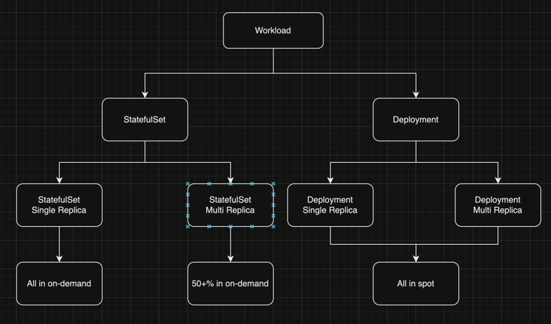

# 分布式调度

## 运行环境

- 节点由按需节点和临时节点组成
- Workload以Deployment和StatefulSet组成
- Workload包含单副本和多副本的负载
- 所有的临时节点可能会同时被终止
- 临时节点会在2分钟通知后终止
- 不设置PDB
- 不考虑存储迁移

## 设计目标

- 不中断服务
- 最大化使用临时节点代替按需节点, 降低成本
- 不改变已使用的调度器, 需要通过别的方式影响调度结果

## 难点分析

1. 需要有一种方式在不改变调度器的情况下影响调度结果
2. 能够让单一工作负载可以按需+临时节点**混合部署**
3. 需要能够尽量达到最大化使用临时节点, 每个负载使用按需节点的界限

### 难点1

需要有一种方式在不改变调度器的情况下影响调度结果

1. Scheduling Framework, 要修改 Kube-Scheduler, 不考虑
2. Scheduler Extenders, 已废弃, 不考虑
3. Node Affinity
4. Taints and Tolerations
5. TopologySpreadConstraints

### 难点2

能够让单一工作负载可以按需+临时节点**混合部署**

#### 1. 将单一负载拆分为两个 Deployment

```yaml
apiVersion: apps/v1
kind: Deployment
metadata:
  name: critical-app-on-demand
spec:
  replicas: 3
  selector:
    matchLabels:
      app: critical-app
  template:
    metadata:
      labels:
        app: critical-app
    spec:
      affinity:
        nodeAffinity:
          requiredDuringSchedulingIgnoredDuringExecution:
            nodeSelectorTerms:
            - matchExpressions:
              - key: node.kubernetes.io/capacity
                operator: In
                values:
                - on-demand
---
apiVersion: apps/v1
kind: Deployment
metadata:
  name: critical-app-spot
spec:
  replicas: 7
  selector:
    matchLabels:
      app: critical-app
  template:
    metadata:
      labels:
        app: critical-app
    spec:
      affinity:
        nodeAffinity:
          preferredDuringSchedulingIgnoredDuringExecution:
            - weight: 100
              preference:
                matchExpressions:
                  - key: node.kubernetes.io/capacity
                    operator: In
                    values:
                      - spot
```

原 Deployment 需要通过 spec.paused 来停止对它的调度.

#### 2. 将单一负载拆分为两个 ReplicaSet

这种方案只适用Deployment, **无法处理StatefulSet**.

由于Deployment和ReplicaSet是**自动关联**, 并且Deployment只会关联一个正在使用的ReplicaSet,
所以如果要拆分为多个ReplicaSet, 那就无法使用Deployment的一些高级特性.

综上此方案**不考虑**.

#### 3. 通过 NodeAffinity + topologySpreadConstraints

负载要求:
- 共 10 Replicas
- 最少 2 Replicas 在按需节点

##### 理想情况

通过配置 topologySpreadConstraints 来告诉调度器正常情况允许的Pod数量的差值为6,
同时在 NodeAffinity 中, 告诉调度器优先调度到 spot 节点上,
在理想情况下, spot 节点的 Replicas 总数为8, on-demand 节点为6, 他们相差6.

##### 非正常情况

在资源不足的情况下, 如 spot 资源不足,
`whenUnsatisfiable: DoNotSchedule` 会尽可能缩小两种节点之前Replicas数量的差距(maxSkew),
如果 `on-demand Replica` 数量要求 < `spot Replica` 数量要求, 会优先保证 `on-demand` 的 Replica 数量.

```yaml
apiVersion: apps/v1
kind: Deployment
metadata:
  name: demo1
spec:
  replicas: 10
  selector:
    matchLabels:
      app: demo1
  template:
    metadata:
      labels:
        app: demo1
    spec:
      affinity:
        nodeAffinity:
          preferredDuringSchedulingIgnoredDuringExecution:
            - weight: 100
              preference:
                matchExpressions:
                  - key: "node.kubernetes.io/capacity"
                    operator: In
                    values:
                      - "spot"
            - weight: 1
              preference:
                matchExpressions:
                  - key: "node.kubernetes.io/capacity"
                    operator: In
                    values:
                      - "on-demand"
      topologySpreadConstraints:
        - maxSkew: 6
          topologyKey: "node.kubernetes.io/capacity"
          whenUnsatisfiable: DoNotSchedule
          labelSelector:
            matchLabels:
              app: demo1
          minDomains: 2
      containers:
        - name: nginx
          image: nginx:latest
```

#### 4. Cluster Autoscaling


#### 5. Update Each Pods' Node Affinity

在不修改Deployment配置的情况下, 我们可以通过逐个修改每个Pod的NodeAffinity,
从而达到我们需要的混合部署的Replica数量.

但是已创建的Pod是不允许修改spec.affinity字段, 我们不能修改scheduler的情况下,
可以考虑通过Webhook在创建新Pod的时候修改/添加他的NodeAffinity,
对于已部署的负载, 我们可以逐个Pod进行手动重启, 重启后设置为我们需要的混合部署配置.
当用户修改目标混合部署配置时, 删除多余的 require-in-on-spot Replica,
或是删除 多余的 prefer-in-spot Replica,
然后在新的Pod创建的时候继续通过Mutating Webhook来修改新的Pod的Affinity.

#### 结果

方案1可以达到要求, 但是实现过于复杂, 且会影响用户看到的资源,
方案3勉强可以达到要求, 但是仍然需要修改Deployment,
方案5不仅可以达到要求, 也可以在用户**无感知**的条件下实现需要的能力.

##### 方案1

优点:
- 在集群资源足够/不足的情况都会尽量按预期的结果进行调度

缺点:
- 维护较难, 比如状态同步, 配置更新
- 对用户不友好, 本来1个Deployment现在成了3个
- 工作量较大, 要先停止原负载的调度(Webhook), 再去维护三个Deployment之间的关系
- 可能对 Prometheus 一类应用不太友好?

##### 方案3

优点:
- 实现简单, 无需维护多个资源, 只需要对每个Workload进行配置即可
- 在集群资源足够的情况下可以按预期结果进行调度

缺点:
- 在 spot 节点不足的情况下, 会导致 on-demand 节点有可能达不到要求的 Replica 数量(视maxSkew和其他条件)
- nodeAffinity 和 topologySpreadConstraints 只是尽量去达到要求, 可能会有非预期的结果
- 如果用户设置了 nodeAffinity / topologySpreadConstraints, 可能会对用户有非预期的调度结果?

##### 方案5

优点:
- 实现不难
- 能够几乎完美的达到混合部署的Replica数量要求

缺点:
- 需要实现Webhook, 有可能需要更多的组件部署在集群上

##### 结论

优先方案5

### 难点3

需要能够尽量达到最大化使用临时节点, 每个负载使用按需节点的界限

#### 注意点

- 要考虑单/多副本工作负载
- 要考虑有/无状态的工作负载
- 可能的结果是通过按需/混合部署的方式处理负载
- 用户能够**自己设定**某负载在按需节点的 Replica

#### 设计思路

对于单副本的Deployment, 它可以视为对高可用的要求不高的负载(如开发/测试环境, 后台任务, 一次性/临时任务)
那么不需要特别关注它单副本的特性, 可以归为多副本工作负载一起考虑.

Deployment 一般是无状态服务, 即使需要持久化数据/Session, 设计上一般也是要放在MySQL/Redis负载中,
所以在我的设计中, 默认情况下 Deployment 负载可以将所有 Replica 放在 spot 节点.

对于单副本的StatefulSet, 虽然它被视为对可用性的要求不高, 但是保证它的可用性的代价是比较低的,
所以在我的设计中默认会放在 on-demand 节点中.

对于多副本的StatefulSet, 一般可能为MySQL/Redis/RabbitMQ等负载,
如果是多主/集群部署下, 一半节点不可用/Master节点不可用会导致应用不可用,
所以在我的设计中, 多副本的StatefulSet, 默认要求**大于一半的节点部署在on-demand**节点上以保证可用性.

同时, 以上所有的配置都是默认情况的配置, 用户可以根据自己的需求去配置一些关键性的负载,
或是降低某些StatefulSet的 on-demand 节点的 Replica 数量要求.

另外可以考虑的点:

1. AI



## 分布式调度器设计

需要的功能点(不一定分多个组件):
- MutatingWebhook
- Scheduler
- Cache(Informers)
- Node信号

目前的思路是将Webhook和Scheduler做在一个main中, 减少需要部署的实际组件数量.


