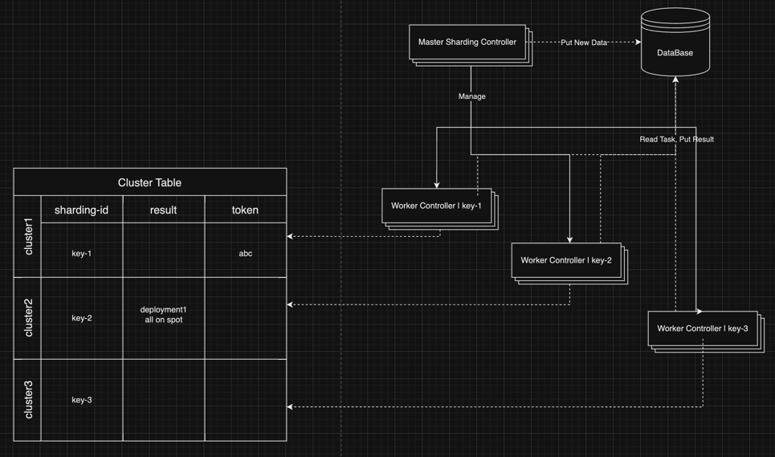
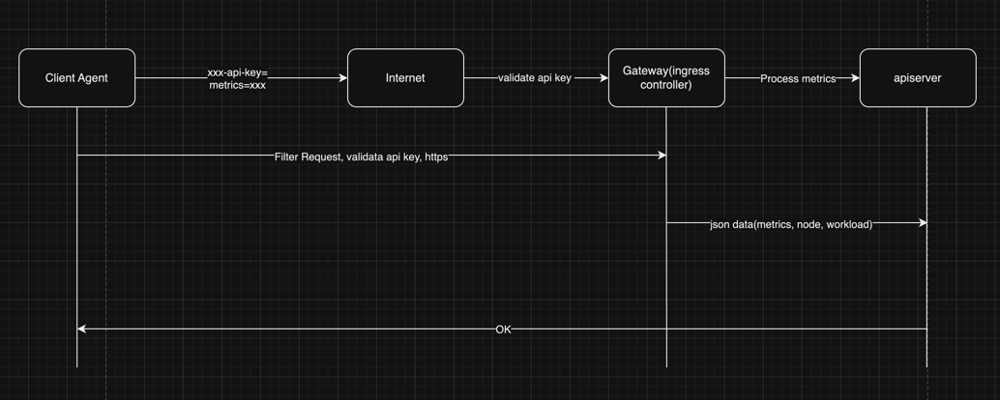
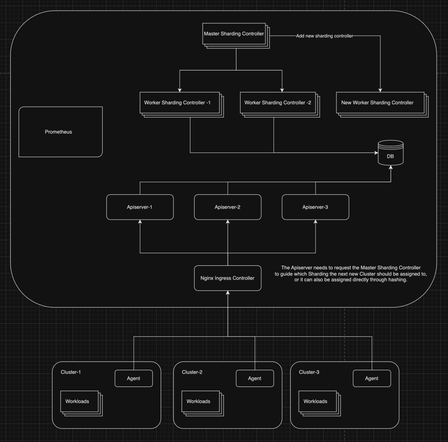

# System Architecture Design

## Components

- Controller
- Apiserver
- Agent

## Design Directions

- Performance
- Security
- HA

## Controller

Analyzing the metrics of each cluster to provide optimization recommendations.

### Performance

<!--
对于绝大多数的 Controller, 高可用采用 LeaderElection+多Replica 实现, 但是正常情况下只有一个 Replica 在工作,
这对于处理单个集群内的 Resource 来说是足够的, 因为它们一般跟业务无关, 是基础架构的 Resource.

但是我们的 Controller 要处理的实际上是其他集群的数据, 也就是**业务数据**.

如此我们可以考虑用一种类似 `MapReduce Master+Worker` 的方式来做到, 避免只有单个 Controller 去计算所有业务数据.
-->

For the vast majority of Controllers, high availability is achieved through Leader **Election plus multiple Replicas**.
However, normally only one Replica is active, which is enough for managing resources within a single cluster,
as these are generally unrelated to business operations and are part of the infra.

However, our Controller actually processes data from other clusters, which is **business data**.

Therefore, we can consider using a method similar to the `MapReduce Master+Worker` approach to avoid having a single
Controller compute all business data.

#### Sharding Controller

<!--
我们可以部署多组 Controller, 每组 Controller 设置不同的 Sharding ID, 同时每组部署(Deployment)竞争不同的锁.
在保证高可用的前提下, 将需要计算的内容拆分.

实现的几个要点:

1. 部署多组 `Worker Controller`, 每组处理/Watch不同的 `Sharding` 对应的数据, 每组竞争不同的锁.
2. 部署一组 `Master Sharding Controller`, 它们负责根据负载需要管理 `Worker Controller` 的组数量, 以及明确新任务应该分到的 `Sharding ID`.
-->

We can deploy multiple sets of Controllers, each set with a different `Sharding ID`, and each set deploying (Deployment)
to compete for different locks. This approach allows us to split the computational tasks while ensuring high availability.

Key points for implementation:

1. Deploy multiple sets of `Worker Controllers`, each set processes/watches data corresponding to different `Sharding` and competes for different locks.
2. Deploy a set of `Master Sharding Controllers`, which are responsible for managing the number of `Worker Controller` groups based on load requirements, and for specifying the `Sharding ID` to which new tasks should be assigned.



<!--
好处:

- 避免单个 Controller 负载需要处理过多数据.
- 避免单个 Controller 负载完全不可用的情况下业务不可用, 在 Sharding Controller 的情况下**仅会导致一组 Sharding ID**的集群信息不被及时处理.

坏处:

- 复杂性更高, 需要维护多组 Worker Controller.
- 需要新部署 Master Sharding Controller.
-->

Advantages:

- Prevents a single Controller from having to process too much data.
- Avoid the scenario where business operations become unavailable if a single Controller is completely down; with `Sharding Controllers`, only the cluster information for one group of `Sharding IDs` would be delayed in processing.

Disadvantages:

- Higher complexity, requiring maintenance of multiple groups of `Worker Controllers`.
- Requires the deployment of a new Master Sharding Controller.

### HA

#### Pod Anti-Affinity Rules

By ensuring that the Pods of each Controller group are **deployed on different Nodes** as much as possible,
we can avoid service unavailability caused by node failures.

```yaml
spec:
  affinity:
    podAntiAffinity:
      preferredDuringSchedulingIgnoredDuringExecution:
        - weight: 10
          podAffinityTerm:
            labelSelector:
              matchExpressions:
                - key: app
                  operator: In
                  values:
                    - controller-key-1
            topologyKey: "kubernetes.io/hostname"
```

#### Pod Liveness Probe

By configuring Liveness probes to determine if each Container is running properly.

```yaml
livenessProbe:
  httpGet:
    path: /healthz
    port: 8888
  # Start run after the Container starts after 15 seconds.
  initialDelaySeconds: 15
  timeoutSeconds: 1
  periodSeconds: 10
```

#### Rolling Update

By implementing rolling updates to achieve zero-downtime upgrades.

```yaml
replicas: 3
strategy:
  type: RollingUpdate
  rollingUpdate:
    maxUnavailable: 1
    maxSurge: 1
```

## Apiserver

Receiving metrics from the Client Cluster reported by the Agent over the public network, such as Deployment/StatefulSet/Node.

### HA

#### HPA

By using HPA, new Apiserver Pods are added when the average CPU usage reaches 50% and
QPS reaches 1000, thereby enhancing availability.

```yaml
apiVersion: autoscaling/v2beta2
kind: HorizontalPodAutoscaler
metadata:
  name: apiserver
spec:
  scaleTargetRef:
    apiVersion: apps/v1
    kind: Deployment
    name: custom-apiserver
  minReplicas: 2
  maxReplicas: 10
  metrics:
    - type: Resource
      resource:
        name: cpu
        target:
          type: Utilization
          averageUtilization: 50
    - type: Pods
      pods:
        metric:
          name: http_requests_per_second
        target:
          type: AverageValue
          averageValue: 1000
```

## Agent

### Performance

<!--
Server-Sent Events (SSE),是一个单向通信的, 基于 HTTP 的标准协议.
在我们的场景中只需要从 Client 推送指标到 Apiserver, 所以单向通信足够.

相比 WebSocket, SSE 更简单, 不需要额外的协议, 通过 `Event Stream` 的形式发送内容.
-->

Server-Sent Events (SSE) is a one-way communication, HTTP-based standard protocol. In our scenario,
since we only need to push metrics from the Client to the Apiserver, one-way communication is enough.

Compared to WebSocket, SSE is simpler as it does not require an additional protocol and sends content in
the form of an `Event Stream`.

### Security

#### API Key Authentication

<!--
在 Agent 与 Apiserver 建立链接中, 我们需要保证身份验证的可靠性.

当用户尝试注册 Cluster 到控制面时, 系统需要为它生成一个 API Key, 如`aaaa-bbbbbb-ccccc`.

用户部署 Agent 时配置该 API Key, 并且要保证不应该暴露给未授权的第三方.

当 Agent 每次发送请求时, 它应在 HTTP 请求中包含它, 如在 Header 中添加 `xxx-api-key: key content`.

随后请求会先经由 Gateway(ingress controller) 组件检查 Header 后再将请求转给 Apiserver.
-->

In establishing a connection between the Agent and the Apiserver, we need to ensure the reliability of identity verification.

When a user attempts to register a Cluster with the control plane, the system needs to generate an API Key,
such as `aaaa-bbbbbb-ccccc`.

The user configures this API Key when deploying the Agent, and must ensure that it is not exposed to unauthorized third parties.

Each time the Agent sends a request, it should include this key in the HTTP request, for example,
by adding `xxx-api-key: key` content to the Header.

Subsequently, the request is first checked by the Gateway (ingress controller) component for the Header before
being forwarded to the Apiserver.



### HA

<!--
对于信息或是负载较多的集群, 我们可以考虑通过 VPA 而不是 HPA 来拓展, 在这里我们考虑的是建立单个链接, 所以正常情况下只有
单一 Pod 真正在处理请求, 那么对于 Pod 的扩缩容毫无意义, 提高 Pod 使用的资源量更有效.
-->

For clusters with heavy data or load, we may consider scaling using VPA (Vertical Pod Autoscaler) instead of
HPA (Horizontal Pod Autoscaler). Here, we are considering establishing a single connection, so normally only a
single Pod is actually processing requests. Therefore, scaling the number of Pods is pointless, and it is more effective
to increase the resources used by the Pod.

```yaml
apiVersion: autoscaling.k8s.io/v1
kind: VerticalPodAutoscaler
metadata:
  name: client-agent-vpa
spec:
  targetRef:
    apiVersion: "apps/v1"
    kind:       Deployment
    name:       client-agent
  updatePolicy:
    updateMode: "Auto"
```

## Gateway

<!--
在请求到达 Apiserver 之前, 我们需要有一层来实现请求过滤以及负载均衡.
Service 只能做到四层负载均衡, 无法对如 Header 一类进行处理, 所以这里考虑使用 Ingress.

以 Nginx Ingress Controller为例.

我们需要配置的能力:

- 对 Header 中的 api-key 做检查, 如果没有指定或是匹配不上则返回如 401.
- 对于请求失败次数过多的 IP 进行封禁.
- 负载均衡, 如 round_robin.
-->

Before requests reach the Apiserver, we need a layer to implement request filtering and load balancing.
A Service can only perform layer-4 load balancing and cannot process elements like Headers,
hence the consideration of using Ingress.

Taking Nginx Ingress Controller as an example.

Capabilities we need to configure:

- Check the api-key in the Header; if it is not specified or does not match, return a status like `401`.
- Block IPs that have repeatedly failed requests.
- Perform load balancing, such as round_robin.

## Cluster

<!--
集群的资源可能面临不足的情况, 在云上部署时可以考虑 Cluster Autoscaler 来实现自动的集群级别扩容.
同时在资源使用率较低时可以移除节点来节省资源.

这里以 Azure 举例, 最少节点3, 最多10个节点.
-->

Cluster resources may face shortages, and when deploying on the cloud, the Cluster Autoscaler
can be considered to automatically scale the cluster at the cluster level. Also, nodes can be
removed when resource utilization is low to save resources.

Here is an example with Azure, with a minimum of 3 nodes and a maximum of 10 nodes.

```shall
az aks create --resource-group myResourceGroup \
--enable-cluster-autoscaler \
--min-count 3 \
--max-count 10 \
```

## Summary

### Components

- Master Sharding Controller
- Worker Sharding Controller
- Prometheus
- Apiserver
- Nginx Ingress Controller
- Agent

### Design


