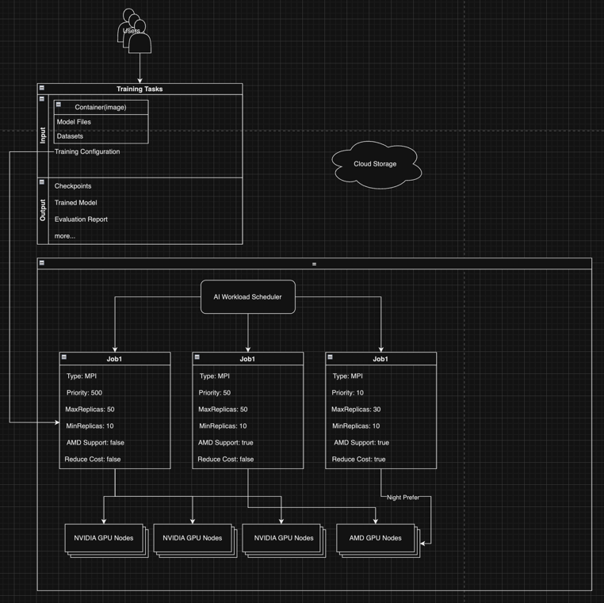

# GPU optimization

## Possible optimization points

1. Training
2. Inference
3. Public cloud(Kubernetes)

## Training optimization points

<!--
- 用户直接提交任务(Docker+Yaml).
- 按任务消耗的资源来收费(预期费用+最终费用).
- 支持弹性可伸缩任务(在可行的情况下用AMD的显卡+谷电).
- 降低颗粒度, 单显卡可以提供给多租户.
- 去掉用户自己部署训练集群的成本.
-->

- Users submit tasks directly (Docker + Yaml).
- Charges are based on the **resources consumed** by the task (expected cost + final cost).
- Supports elastic scalable tasks (using AMD GPUs and valley electricity when feasible).
- Reduce granularity; a single GPU can be **shared among multiple tenants**.
- Eliminate the cost of users deploying their own training clusters.



### Submit task

<!--
用户通过镜像的形式他的 Training 任务, 以及运行任务的一些设置.

用户的镜像以及训练完成后的数据(Checkpoints, Report, Trained Model)由云存储负责.

当然训练数据也不一定要放在Image中, 可能会导致镜像过大, 可以选择放到云存储后通过网络获得.
-->

- Users submit their training tasks and some settings for running the tasks via **images**.

- The user's images and data after training completion (checkpoints, report, trained model) are **managed by cloud storage**.

- Of course, the training data does not necessarily have to be included in the image, as this may lead to excessively large images. Alternatively, it can be placed in cloud storage and accessed over the network.

```yaml
# Platform configurations.
TaskName: training1
# The higher the priority, the higher the price. The platform does not guarantee the completion time of the training.
Priority: 50
# Task type, e.g., MPI requires two types of images, Master + Worker.
TaskType: MPI
# Determines the minimum and maximum number of Pods required for running the task.
MaxReplicas: 50
MinReplicas: 10
# Whether the task supports AMD GPU.
AMDSupport: true
# Whether there is a need to reduce consumption (for example, allocating more Replicas only when the cluster is
# relatively idle, characterized as preemptible, or running at night using off-peak electricity, similar to the logic of electric cars).
ReduceCost: true

# AI training task configurations.
TaskImage: vacant.io/training:1.0
MasterImage: vacant.io/training-master:1.0
WorkerImage: vacant.io/training-worker:1.0
MasterMaxReplicas: 10
WorkerMaxReplicas: 40
# and more ai training task configurations.
```

### Cost Structure:

<!--
- 任务的资源消耗量(比如占用了多少GPU的多少资源)
- 根据优先级来对价格进行调整(优先级越高则对总价的增幅越高)
- 任务使用的显卡类型(AMD GPU 性价比和效能更好, 但是 NVIDIA 支持的更广泛, 使用 AMD 则可以降低费用)
- 使用谷电的情况

平台将在任务提交时给出一个预期的费用, 并且在运行完毕后给出最终费用.

平台不应对完成时间做出承诺, 尤其是低优先级+ReduceCost的情况下.

如果用户想最大化的节省成本, 那么它应该使用优先级为0, 并且ReduceCost = true, 来尽量使用谷电.
在任务允许的情况下使用AMD的GPU来进行训练.
-->

- The resource consumption of the task (e.g., how much of a GPU's resources are used).
- Price adjustment based on priority (the higher the priority, the greater the increase in the total price).
- The type of GPU used in the task (AMD GPUs are more cost-effective and performant, but NVIDIA is more widely supported; using AMD can reduce costs).
- Use of off-peak electricity.

The platform will provide an estimated cost at the time of task submission and a final cost after completion.

The platform should not make commitments about completion times, especially in cases of low priority + ReduceCost.

If users want to maximize cost savings, they should use a priority of 0 and set ReduceCost = true to use off-peak
electricity as much as possible and opt for AMD GPUs for training when possible.

### Target Users:

<!--
目标任务首先应为中小型的企业或个人, 帮助他们去掉自己部署平台以及调试所浪费的时间, 并且实现完全的按需来降低用户的成本.

如研究所, 高校学生等资源不足或没有能够满足要求的硬件的用户.

对于大型企业这种用户, 我们能降低的成本则可能显得微不足道, 甚至吃满平台的所有资源导致无卡可用.
-->

The target tasks should first be aimed at small and medium-sized businesses or individuals,
helping them eliminate the time wasted in deploying and debugging their own platforms,
and achieve cost reductions on a demand-driven basis.

Such as research institutions, college students, and other users who lack resources or do not
have the hardware needed to meet requirements.

For large enterprises, the costs we can reduce may seem negligible, and they may even consume
all of the platform's resources, resulting in no GPUs available.
